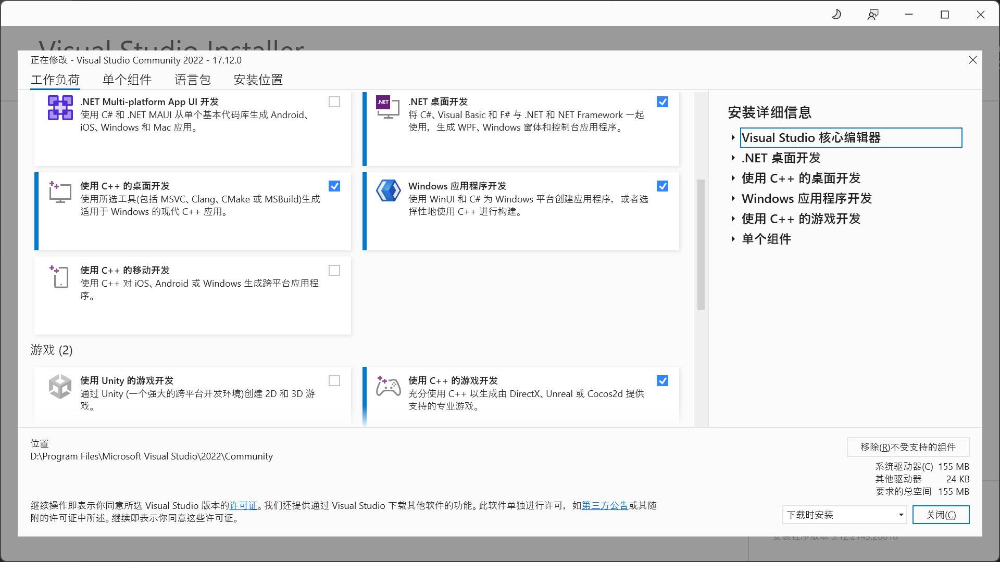
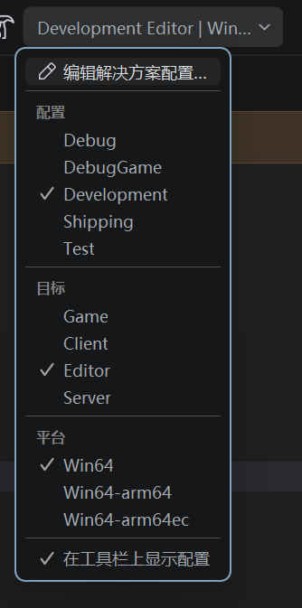
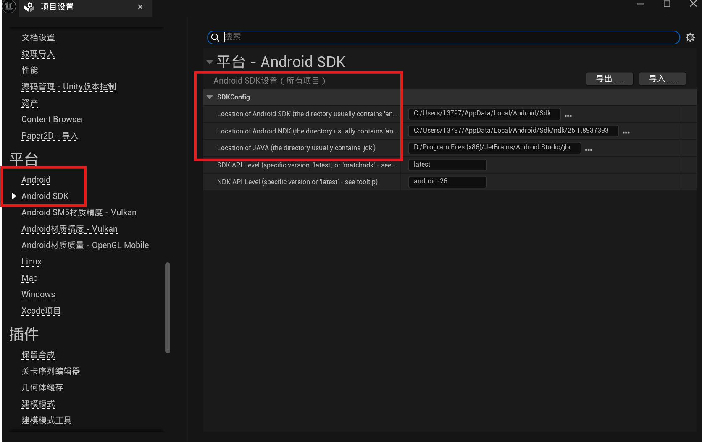
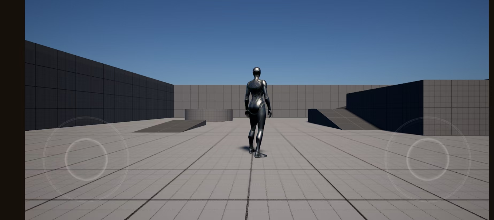

# 前置流程

- 注册GitHub账号
- 注册EPIC账号
- 将EPIC和Github账号关联，[流程参考官方链接](https://www.unrealengine.com/zh-CN/ue-on-github )（如果在[虚幻引擎账户绑定GitHub界面](https://www.epicgames.com/account/personal)时没有任何反应，建议开启加速器加速EPIC，本人当时使用过VPN和加速器，发现VPN加速无效果，使用雷神加速器加速EPIC后可以正常点击GitHub进行绑定）
- 绑定成功后会收到EPIC发送的加入Github组织的邮件，加入后就能在GitHub上看到Unreal的[源代码](https://github.com/EpicGames/UnrealEngine)
- 选择版本克隆仓库到本地，本人使用的是最新的5.5版本

# Visual Studio 安装和设置

- 从[官网](https://visualstudio.microsoft.com/zh-hans/vs/)下载最新版VS2022社区版
- 本人安装的组件如下，其中包含.NET 桌面开发，使用C++的桌面开发，Windows应用程序开发和使用C++游戏开发。其中使用c++的游戏开发中的Unreal Engine 安装程序要记得下载，默认没有勾选。

# Unreal下载、安装以及编译

- 在下载的UnrealEngine-release根目录中，双击**Setup.bat**下载依赖包，如果成功下载CMD会自动退出，否则会报错
- 在根目录中运行**GenerateProjectFiles.bat**配置VS项目文件，同上，如果成功会自动退出。
- 前两步运行完后会在根目录生成**UE5.sln**，使用VS打开
- 将解决方案配置设置为 开发编辑器（Development Editor），然后将解决方案平台设置为 Win64，最后右键Engine文件夹中的UE5并选择 构建（Build）
- 开始睡觉

# 本人习惯使用JetBrains公司的产品，所以也使用了Rider进行构建

- 打开[JetBrains ToolBox](https://www.jetbrains.com/zh-cn/lp/toolbox/)下载Rider
- Rider构建和上述VS一样，使用Rider打开**UE5.sln**，构建选项设置如下

- 右键UE5文件夹，构建所选项目

# 启动UE5编辑器

- 右键UE5设置为启动项目
- Debug->以新的实例开始
- 打开UE5后选择第三人称项目，C++，移动平台，可压缩。创建，注意项目名不要中文，使用英文
- 创建完后会自动打开VS，也可以在UE项目设置中设置默认编辑器为其他，如Rider，选择刚刚创建的项目名，右键构建，构建完后运行

# 下载安卓SDK和NDK

- 打开JetBrains ToolBox下载Android Studio，**注意**一定要安装在默认路径：C:\Program Files\Android\Android Studio，否则后面会报错，找不到Android Studio
- 下载完后打开AS，一直继续next，安装和配置默认组件，选择更多操作-> SDK Manager->Android SDK Location->Edit->选择SDK下载
- 勾选show package details
- SDK Tools->Android SDK Command-line Tools (latest)->点击applay下载->Finish
- PLATFORMS_VERSION：android-34，BUILDTOOLS_VERSION：34.0.0，CMAKE
- 或者直接运行UnrealEngine-release\Engine\Extras\Android下的SetupAndroid.bat自动安装

# 配置UE的SDK和NDK路径

- 打开UE->编辑->项目设置->平台->Android SDK配置为如图所示->Android->接受证书

- 返回UE项目->平台->Android->选择Android ETC2，开发->打包项目->选择文件夹输出
- 完成

# 由源码编译的UE5.5导出的安卓开发包位于**day1/Android_ETC2.zip**

