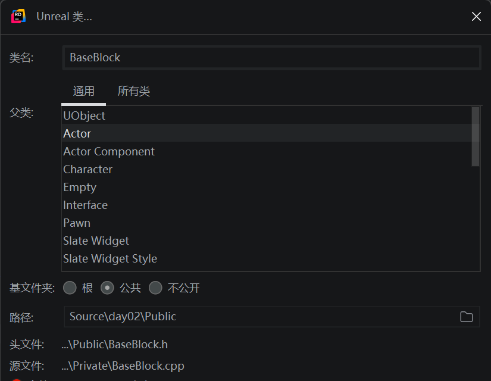

# 初始化项目

打开上节课从源代码编译后的UE5.5，在游戏中选择第一人称模板创建项目，创建完后使用Rider打开并编译。

# 创建基础方块

- 在Rider中右键项目文件夹添加Ureal类，类名为**BaseBlock**，继承自通用Actor，基文件夹选择公共，这样就创建了一个AActor的子类，并且会在项目目录中的**public**文件夹下创建头文件，在private文件夹下创建c++文件。



- 为了设置射击方块获得x分，并且方块被命中后缩放为y倍，需要在BaseBlock头文件中声明这些变量，并且声明方块被子弹击中的OnHit方法，声明该方块是否为重要目标，是否被击中。其中每个方块的基础得分BasePoints，命中后的缩放倍数BaseScale都可以在UE编辑器中通过蓝图修改。

```C++
public:
	UFUNCTION()
	void OnHit(UPrimitiveComponent* HitComponent, AActor* OtherActor, UPrimitiveComponent* OtherComp, FVector NormalImpulse, const FHitResult& Hit);
	// Sets default values for this actor's properties
	ABaseBlock();
	void UpdateBlockState();

	bool IsImportant = false;
	// 摧毁一个方块的基础得分
	UPROPERTY(EditAnywhere, BlueprintReadWrite, Category = "Base feature", meta = (AllowPrivateAccess = "true"))
	int32 BasePoints = 1;

protected:
	// Called when the game starts or when spawned
	virtual void BeginPlay() override;
	
	// 方块被攻击后的基础缩放
	UPROPERTY(EditAnywhere, BlueprintReadWrite, Category = "Base feature", meta = (AllowPrivateAccess = "true"))
	int32 BaseScale = 2;
	
	bool IsHitEd = false;
```

- 在C++文件中实现该方法，其中如果方块为重要目标则为绿色，否者设置为红色。OnHit方法主要判断是哪个角色发射的子弹命中方块，如果是第一次命中，则方块膨胀为BaseScale倍，否者发射子弹的角色得分，然后方块摧毁。

```c++
ABaseBlock::ABaseBlock()
{
	// Set this actor to call Tick() every frame.  You can turn this off to improve performance if you don't need it.
	PrimaryActorTick.bCanEverTick = true;
	// 创建组件（看得见的物体）函数，生成一个 Actor 的实例，使其与 unreal 系统兼容
	BaseCube = CreateDefaultSubobject<UStaticMeshComponent>(TEXT("Cube"));
	// 将 BaseCube 添加 Actor 的根组件：位置、旋转、缩放
	RootComponent = BaseCube;
	// 加载形状
	static ConstructorHelpers::FObjectFinder<UStaticMesh> CubeVisualAsset(TEXT("/Game/StarterContent/Shapes/Shape_Cube.Shape_Cube"));
	// 判断是否生成 立方体 
	if (CubeVisualAsset.Succeeded())
	{
		// 将查找到的立方体组件加载到 BaseCube 中
		BaseCube->SetStaticMesh(CubeVisualAsset.Object);
		// 设置组件 VisualMesh 的位置在父组件的中心点或原点位置
		BaseCube->SetRelativeLocation(FVector(0.0f, 0.0f, 0.0f));
		// 设置BaseCube的缩放
		BaseCube->SetWorldScale3D(FVector(0.5f, 0.5f, 0.5f));
	}
}

void ABaseBlock::UpdateBlockState()
{
	if (UMaterial* LoadedMaterial = LoadObject<UMaterial>(nullptr, TEXT("/Script/Engine.Material'/Engine/MapTemplates/Materials/BasicAsset01.BasicAsset01'")))
	{
		BaseCube->SetMaterial(0, LoadedMaterial);
	}
	BasePoints *= 2;
}

// Called when the game starts or when spawned
void ABaseBlock::BeginPlay()
{
	Super::BeginPlay();

	// 挂载碰撞事件
	BaseCube->OnComponentHit.AddDynamic(this, &ABaseBlock::OnHit);

	// GEngine->AddOnScreenDebugMessage(-1, 5.f, FColor::White, TEXT("Spawn ABaseBlock"));
	// 加载材质
	if (UMaterial* LoadedMaterial = LoadObject<UMaterial>(nullptr, TEXT("/Script/Engine.Material'/Engine/MapTemplates/Materials/BasicAsset03.BasicAsset03'")))
	{
		BaseCube->SetMaterial(0, LoadedMaterial);
	}
}


void ABaseBlock::OnHit(UPrimitiveComponent* HitComponent, AActor* OtherActor, UPrimitiveComponent* OtherComp,
                       FVector NormalImpulse, const FHitResult& Hit)
{
	if (!IsHitEd)
	{
		const FVector Scale = FVector(BaseScale);
		BaseCube->SetWorldScale3D(Scale);
		IsHitEd = true;
	}
	else
	{
		// 更新玩家得分
		if (const Aday02Projectile * Projectile = Cast<Aday02Projectile>(OtherActor))
		{
			Projectile->ShootCharacter->TotalScore += BasePoints;
			// GEngine->AddOnScreenDebugMessage(-1, 5.f, FColor::White, FString::Printf(TEXT("玩家1得分: %d"), Projectile->ShootCharacter->TotalScore));
			this->Destroy();
		}
	}
}

// Called every frame
void ABaseBlock::Tick(float DeltaTime)
{
	Super::Tick(DeltaTime);

	// 定义一个向量，用于存放立方体组件 BaseBlock 的位置信息
	FVector NewLocation = GetActorLocation();
	// 定义一个向量，用于存放立方体组件 BaseBlock 的旋转信息
	FRotator NewRotation = GetActorRotation();
	// 获取当前 CubeActor 自创建以来经过的时间（以秒为单位）
	const float RunningTime = GetGameTimeSinceCreation();
	// 计算这两个时点的正弦值差，这个差值表示在最近的一帧时间内正弦波的变化量。
	const float DeltaHeight = FMath::Sin(RunningTime + DeltaTime) - FMath::Sin(RunningTime);
	// 更新高度；按FloatSpeed调整高度
	NewLocation.Z += DeltaHeight * 20.0f;
	// 每秒旋转等于RotationSpeed的角度
	const float DeltaRotation = DeltaTime * 20.0f;
	// 更新旋转的角度
	NewRotation.Yaw += DeltaRotation;
	// 设置立方体的高度以及旋转的角度
	SetActorLocationAndRotation(NewLocation, NewRotation);
}

```

# 子弹类 Projectile

- 在UE第一人称模板的基础上加上一些额外功能，由于需要知道子弹是哪个角色发射的，所以需要在头文件中声明

```c++
UPROPERTY()
Aday02Character* ShootCharacter = nullptr;
```

- 在OnHit方法中添加，如果子弹射击的对象是BaseBlock则摧毁子弹

```c++
void Aday02Projectile::OnHit(UPrimitiveComponent* HitComp, AActor* OtherActor, UPrimitiveComponent* OtherComp,
                             FVector NormalImpulse, const FHitResult& Hit)
{
	// Only add impulse and destroy projectile if we hit a physics
	if ((OtherActor != nullptr) && (OtherActor != this) && (OtherComp != nullptr))
		if (OtherComp->IsSimulatingPhysics())
		{
			OtherComp->AddImpulseAtLocation(GetVelocity() * 100.0f, GetActorLocation());

			Destroy();
		}
		else if (const ABaseBlock * BaseBlock = Cast<ABaseBlock>(OtherActor))
		{
			Destroy();
		}
}
```

# 武器组件类 WeaponComponent

- 当玩家角色拿到武器射击后会生成子弹，在此时需要给子弹绑定时哪个角色发射的这个子弹，在Fire()函数中添加

```c++
// Spawn the projectile at the muzzle 设置发射者
Aday02Projectile* Projectile = World->SpawnActor<Aday02Projectile>(ProjectileClass, SpawnLocation, SpawnRotation, ActorSpawnParams);
Projectile->ShootCharacter = Cast<Aday02Character>(Character);
```

# 游戏模式类 GameMode

这次作业的主要技术点就在于BaseBlock和GameMode，在游戏模式中要定义游戏开始时随机的n个方块成为重要目标，并且可以获得双倍积分，游戏倒计时T秒，时间到后游戏结算

- 在头文件中定义生成的方块数量，重要目标数量，游戏总时间，以及倒计时计时器。其中方块数量NumberOfBlocks，重要目标数量NumberOfImportantBlocks，倒计时时间GameDuration都可以在UE编辑器中策划通过蓝图修改，路径为/All/Game/FirstPerson/Blueprints/BP_FirstPersonGameMode

```c++
protected:
	virtual void BeginPlay() override;

	UPROPERTY(EditAnywhere, Category="Block Settings")
	int32 NumberOfBlocks = 10;

	UPROPERTY(EditAnywhere, Category="Block Settings")
	int32 NumberOfImportantBlocks = 3;

	UPROPERTY(EditAnywhere, Category="Block Settings")
	int32 GameDuration = 5;
private:
	void EndGame();
	FTimerHandle GameTimerHandle;
	void UpdateCountdownTimer();
	FTimerHandle CountdownTimerHandle;
	int32 RemainingTime = 0;
```

- 在c++文件中实现方法。在BeginPlay中生成生成 x个 BaseBlocks并随机选择 N个 BaseBlocks 作为重要目标，开启倒计时GameTimerHandle计时器，并在计时器结算后退出游戏在日志中打印输出每个玩家的积分

```c++
void Aday02GameMode::BeginPlay()
{
	Super::BeginPlay();

	// 生成 x个 BaseBlocks
	TArray<ABaseBlock*> SpawnedBlocks;
	for (int32 i = 0; i < NumberOfBlocks; i++)
	{
		FVector Location = FVector(1400 + i * 100.0f, 600 + i * 100.0f, 300.0f);
		FRotator Rotation = FRotator::ZeroRotator;
		if (ABaseBlock* NewBlock = GetWorld()->SpawnActor<ABaseBlock>(ABaseBlock::StaticClass(), Location, Rotation))
		{
			SpawnedBlocks.Add(NewBlock);
		}
	}
	// 随机选择 N个 BaseBlocks 作为重要
	if (SpawnedBlocks.Num() > 0)
	{
		for (int32 i = 0; i < NumberOfImportantBlocks; ++i)
		{
			const int32 RandomIndex = UKismetMathLibrary::RandomIntegerInRange(0, SpawnedBlocks.Num() - 1);
			SpawnedBlocks[RandomIndex]->IsImportant = true;
			SpawnedBlocks[RandomIndex]->UpdateBlockState();
			SpawnedBlocks.RemoveAt(RandomIndex); // Ensure the same block is not marked twice
		}
	}
	RemainingTime = GameDuration;
	// 启动重复计时器，每秒更新一次倒计时，显示剩余时间
	GetWorldTimerManager().SetTimer(CountdownTimerHandle, this, &Aday02GameMode::UpdateCountdownTimer, 1.0f, true);

	GetWorldTimerManager().SetTimer(GameTimerHandle, this, &Aday02GameMode::EndGame, GameDuration, false);
}

void Aday02GameMode::EndGame()
{
	// 清除倒计时计时器
	GetWorldTimerManager().ClearTimer(CountdownTimerHandle);
	// 获取所有玩家并打印每个玩家的积分
	for (FConstPlayerControllerIterator It = GetWorld()->GetPlayerControllerIterator(); It; ++It)
	{
		const APlayerController* PlayerController = It->Get();
		if (const Aday02Character* Character = Cast<Aday02Character>(PlayerController->GetPawn()))
		{
			UE_LOG(LogTemp, Warning, TEXT("游戏结束，玩家%s得分: %d"), *Character->GetName(), Character->TotalScore);
			// GEngine->AddOnScreenDebugMessage(-1, 5.f, FColor::Red, FString::Printf(TEXT("游戏结束，玩家%s得分: %d"), *Character->GetName(), Character->TotalScore));
		}
	}
	// 退出游戏
	if (const UWorld* World = GetWorld())
	{
		if (APlayerController* PlayerController = World->GetFirstPlayerController())
		{
			UKismetSystemLibrary::QuitGame(World, PlayerController, EQuitPreference::Quit, true);
		}
	}
}

void Aday02GameMode::UpdateCountdownTimer()
{
	if (RemainingTime > 0)
	{
		--RemainingTime;
		GEngine->AddOnScreenDebugMessage(-1, 1.f, FColor::Red, FString::Printf(TEXT("剩余时间: %d"), RemainingTime));
	}
}

```

# 打包作业位于homework中
