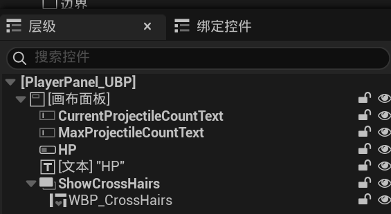

# 实现登录界面和加载动画

## 实现登录界面样式

- 新建一个关卡蓝图用来作为登录界面的地图蓝图，我使用的是虚幻自带的初始学习包中的地图，位于：`/All/Game/StarterContent/Maps/StartMap`
- 新建一个UserWidget蓝图类，取名Login_UBP
- 拖入组件如下摆放


- 层级关系如下，其中ProgressBar是游戏加载的进度条


- 设置鼠标移动到进入游戏按钮和退出游戏按钮上不同的特效


- 密码加密显示在密码的EditableText中的细节选项面板中外观–>为密码勾选即可


## 实现登录界面功能

- 设置初始用户名和密码为123，并且新建LoginPassword和LoginAccount两个变量用来存放用户输入的账户和密码以便之后验证


- 点击退出游戏按钮退出游戏


- 创建提示动画RemindAnim，如果账户或密码错误弹出提示动画


- 创建自定义函数RemindFunc调用刚刚创建的动画RemindAnim


- 给进入游戏按钮绑定点击事件，当进入游戏按钮被点击后，验证用户输入的LoginPassword和LoginAccount是否正确，如果账户和密码正确，创建一个定时器调用加载的动画，如果密码错误则调用上述的自定义函数RemindFunc播放错误提示动画


- 加载动画函数如下，每次执行定时器每次加载10%进度，虚拟加载


## 挂载ViewPort

在关卡蓝图里实例化刚刚创建的Login_UBP，并添加到Viewport，然后调用Player Controller的Show Mouse Cursor方法显示光标。


# 实现射击游戏操作面板

## 前置操作

在Build.cs中的`PublicDependencyModuleNames`加入UMG字段，否则编译不通过

```c++
PublicDependencyModuleNames.AddRange(new string[] { "Core", "CoreUObject", "Engine", "InputCore", "EnhancedInput","UMG" });
```


## 实现射击游戏操作界面

- 在Rider中新建C++类UPlayerPanel，继承自UserWidget，在头文件中定义稍后需要操作的组件。其中有当前子弹数，最大子弹数，玩家血量，准星显示和更新子弹数目的函数

```c++
class DAY02_API UPlayerPanel : public UUserWidget
{
	GENERATED_BODY()
	
public:
	UPROPERTY(BlueprintReadWrite, meta = (BindWidget))
	UEditableTextBox* CurrentProjectileCountText;
	UPROPERTY(BlueprintReadWrite, meta = (BindWidget))
	UEditableTextBox* MaxProjectileCountText;
	UPROPERTY(BlueprintReadWrite, meta = (BindWidget))
	UProgressBar* HP;
	UPROPERTY(BlueprintReadWrite, meta = (BindWidget))
	UOverlay* ShowCrossHairs;

	UFUNCTION()
	void UpdateAmmoCount(int32 NewCurrentAmmo, int32 NewMaxAmmo);

};

void UPlayerPanel::UpdateAmmoCount(int32 NewCurrentAmmo, int32 NewMaxAmmo)
{
	CurrentProjectileCountText->SetText(FText::AsNumber(NewCurrentAmmo));
	MaxProjectileCountText->SetText(FText::AsNumber(NewMaxAmmo));
}

```

- 在UE编辑器中新建用户控件继承自刚刚创建的UPlayerPanel，布局如下


- 层级如下



- 在玩家的角色类Character头文件中定义要显示的HUD和HUD类以及更新子弹数的方法

```C++
public:
	UPROPERTY(EditAnywhere, BlueprintReadWrite, Category="UI")
	TSubclassOf<UUserWidget> WeaponHUDClass;

	UPROPERTY(EditAnywhere,BlueprintReadWrite)
	UPlayerPanel* WeaponHUD;

	UPROPERTY()
	mutable float CrossHairsAngle = 0.0f;
	UPROPERTY()
	float CrossHairsScale = 0.0f;
	
	UFUNCTION()
	void UpdateAmmoCount(int32 CurrentAmmo, int32 MaxAmmo);
	

```

- 在C++文件中实例化PlayerPanel_UBP类以及实现更新子弹数的方法UpdateAmmoCount

```C++
// 构造函数 Set default class for WeaponHUDClass
	static ConstructorHelpers::FClassFinder<UUserWidget> WeaponHUDObj(TEXT("/Game/MyGame/BP/PlayerPanel_UBP"));
	if (WeaponHUDObj.Succeeded())
	{
		WeaponHUDClass = WeaponHUDObj.Class;
	}

void Aday02Character::BeginPlay()
{
	Super::BeginPlay();

	// 创建Player Panel Widget
	if (UPlayerPanel* PlayerPanelWidget = CreateWidget<UPlayerPanel>(GetWorld(),WeaponHUDClass))
	{
		// 将Widget添加到视口
		PlayerPanelWidget->AddToViewport();
		PlayerPanelWidget->SetVisibility(ESlateVisibility::Visible);

		// 存储Widget的引用，以便后续更新
		WeaponHUD = PlayerPanelWidget;
	}
}

void Aday02Character::UpdateAmmoCount(int32 CurrentAmmo, int32 MaxAmmo)
{
	if (WeaponHUD && WeaponHUD->CurrentProjectileCountText && WeaponHUD->MaxProjectileCountText)
	{
		WeaponHUD->CurrentProjectileCountText->SetText(FText::AsNumber(CurrentAmmo));
		WeaponHUD->MaxProjectileCountText->SetText(FText::AsNumber(MaxAmmo));
	}
}
```


- 实现当玩家捡到武器时显示准星，并且更新右下加的子弹数和最大子弹数。在WeaponComponent头文件中定义当前武器子弹数和最大子弹数

```c++

	UPROPERTY(EditAnywhere, BlueprintReadWrite, Category="Projectile")
	int32 MaxProjectileCount = 32;
	
	UPROPERTY(EditAnywhere, BlueprintReadWrite, Category="Projectile")
	int32 CurrentProjectileCount = 32;

```

- 在WeaponComponent的C++文件的AttachWeapon函数中，当玩家捡起武器时更新当前子弹数和最大子弹数，并且显示武器准星

```c++
bool Uday02WeaponComponent::AttachWeapon(Aday02Character* TargetCharacter)
{
	Character = TargetCharacter;

	// Check that the character is valid, and has no weapon component yet
	if (Character == nullptr || Character->GetInstanceComponents().FindItemByClass<Uday02WeaponComponent>())
	{
		return false;
	}

	// Attach the weapon to the First Person Character
	FAttachmentTransformRules AttachmentRules(EAttachmentRule::SnapToTarget, true);
	AttachToComponent(Character->GetMesh1P(), AttachmentRules, FName(TEXT("GripPoint")));

	// Set up action bindings
	if (APlayerController* PlayerController = Cast<APlayerController>(Character->GetController()))
	{
		if (UEnhancedInputLocalPlayerSubsystem* Subsystem = ULocalPlayer::GetSubsystem<UEnhancedInputLocalPlayerSubsystem>(PlayerController->GetLocalPlayer()))
		{
			// Set the priority of the mapping to 1, so that it overrides the Jump action with the Fire action when using touch input
			Subsystem->AddMappingContext(FireMappingContext, 1);
		}

		if (UEnhancedInputComponent* EnhancedInputComponent = Cast<UEnhancedInputComponent>(PlayerController->InputComponent))
		{
			// Fire
			EnhancedInputComponent->BindAction(FireAction, ETriggerEvent::Triggered, this, &Uday02WeaponComponent::Fire);
		}
	}

	Character->WeaponHUD->CurrentProjectileCountText->SetVisibility(ESlateVisibility::Visible);
	Character->WeaponHUD->MaxProjectileCountText->SetVisibility(ESlateVisibility::Visible);
	Character->WeaponHUD->ShowCrossHairs->SetVisibility(ESlateVisibility::Visible);
	Character->UpdateAmmoCount(CurrentProjectileCount,MaxProjectileCount);
	return true;
}
```

- 在玩家开火时调用Character的UpdateAmmoCount方法更新当前子弹数

```C++
void Uday02WeaponComponent::Fire()
{
	if (Character == nullptr || Character->GetController() == nullptr)
	{
		return;
	}

	// Try and fire a projectile
	if (ProjectileClass != nullptr)
	{
		if (UWorld* const World = GetWorld(); World != nullptr)
		{
			APlayerController* PlayerController = Cast<APlayerController>(Character->GetController());
			const FRotator SpawnRotation = PlayerController->PlayerCameraManager->GetCameraRotation();
			// MuzzleOffset is in camera space, so transform it to world space before offsetting from the character location to find the final muzzle position
			const FVector SpawnLocation = GetOwner()->GetActorLocation() + SpawnRotation.RotateVector(MuzzleOffset);

			//Set Spawn Collision Handling Override
			FActorSpawnParameters ActorSpawnParams;
			ActorSpawnParams.SpawnCollisionHandlingOverride = ESpawnActorCollisionHandlingMethod::AdjustIfPossibleButDontSpawnIfColliding;

			// Spawn the projectile at the muzzle 设置发射者
			Aday02Projectile* Projectile = World->SpawnActor<Aday02Projectile>(ProjectileClass, SpawnLocation, SpawnRotation, ActorSpawnParams);
			Projectile->ShootCharacter = Cast<Aday02Character>(Character);

			CurrentProjectileCount--;
			Character->UpdateAmmoCount(CurrentProjectileCount,MaxProjectileCount);
		}
	}

	// Try and play the sound if specified
	if (FireSound != nullptr)
	{
		UGameplayStatics::PlaySoundAtLocation(this, FireSound, Character->GetActorLocation());
	}

	// Try and play a firing animation if specified
	if (FireAnimation != nullptr)
	{
		// Get the animation object for the arms mesh
		UAnimInstance* AnimInstance = Character->GetMesh1P()->GetAnimInstance();
		if (AnimInstance != nullptr)
		{
			AnimInstance->Montage_Play(FireAnimation, 1.f);
		}
	}
}
```

# 作业效果位于day4作业mp4中